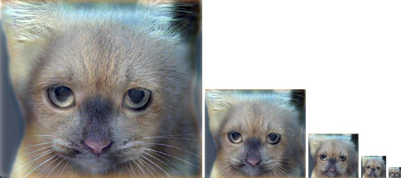
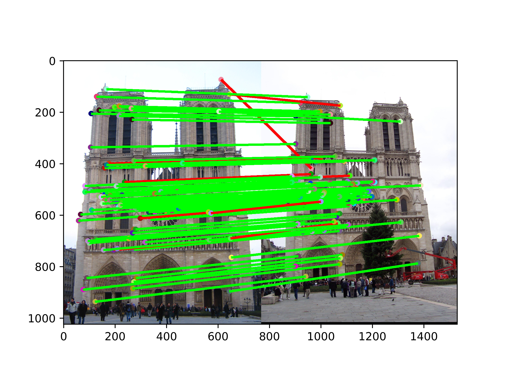
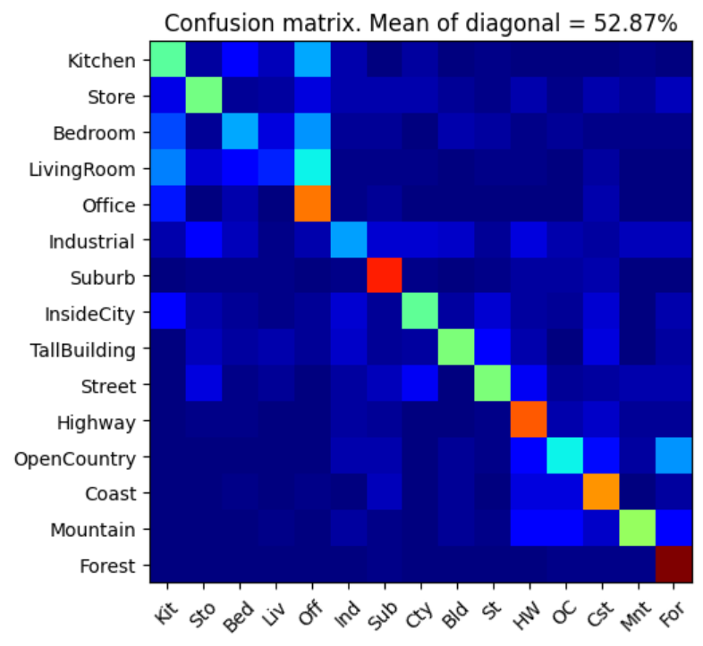
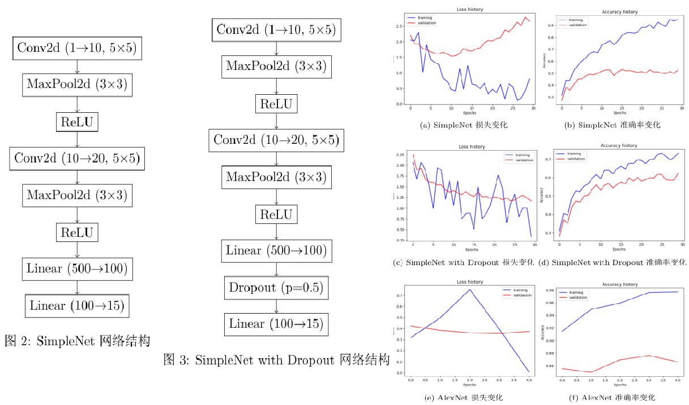

# UESTC Advanced CV Project

电子科技大学研究生课程《高级计算机视觉》实验报告，内容来自CS4476。

**proj1**

**内容**：图像滤波与混合。

**实现**：

1. 滤波器生成函数：生成二维高斯核，采用循环和numpy形式实现。
2. 卷积函数：卷积操作，采用循环、矩阵乘法、img2col、numpy kernel trick、fft形式实现。

**proj2**

**内容**：基于SIFT的特征提取和匹配。

**实现**：

1. 距离度量函数：采用欧氏距离、曼哈顿距离、切比雪夫距离、闵可夫斯基距离等实现。
2. 特征匹配和过滤函数：采用暴力匹配，之后通过特征距离、特征相似度、交叉验证、KNN、空间距离和角度等过滤器进一步筛选高质量匹配。

**额外工作**：对所有过滤器的超参数进行搜索。

**proj3**

**内容**：基于bag of visual words的图像分类。

**实现**：

1. 距离度量函数：采用欧氏距离，*大矩阵计算缓慢，建议使用cupy加速！*
2. KMeans：聚类
3. KNN：分类器
4. 词典构造函数：通过SIFT提取训练集局部特征，聚类成固定数量，将聚类中心作为词典中的词
5. 词频向量计算函数：通过SIFT提取测试图像特征，与词典中的最近词进行匹配，统计每个词的出现次数，得到词频向量

**额外工作**：对词典大小、K值、SIFT步长进行搜索。

**proj4**

**内容**：基于深度学习的图像分类

**实现**：

1. SimpleNet
2. SimpleNet with Dropout
3. Data Augmentation

**额外工作**：对数据增强和Dropout概率的超参数搜索

